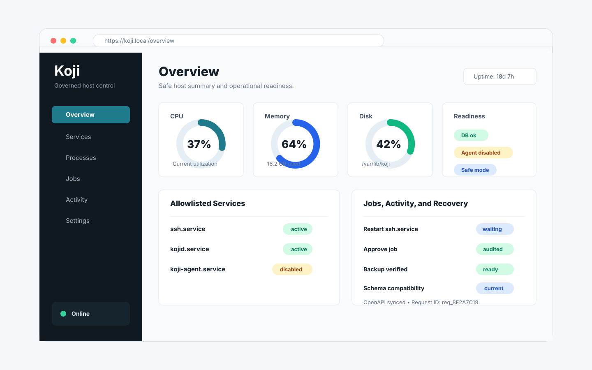

<div align="center">

# Koji

[](https://go.dev/)
[](https://www.typescriptlang.org/)
[](https://react.dev/)
[](https://tauri.app/)
[](https://sqlite.org/)
[](https://www.gnu.org/software/bash/)

</div>



Koji is a modern control panel built for operators who want clarity, confidence, and calm control over their servers. It turns the noisy, high-risk work of host administration into a focused operating experience: see what matters, understand what changed, approve sensitive actions deliberately, and keep a durable record of the decisions that shape your environment. Koji is designed to feel trustworthy from the first screen: polished enough for daily operations, restrained enough for production systems, and structured around the idea that powerful infrastructure tools should be governed, visible, and easy to reason about.

## Architecture Overview

Koji is split into clear responsibility zones:

- `kojid` serves the authenticated web/API control plane.
- `koji-agent` owns the privileged local boundary.
- SQLite stores users, sessions, capabilities, audit events, and jobs.
- The React/TypeScript frontend provides the operator workspace.
- Service-control intent flows through capability checks, audit, durable jobs, approval, and the agent boundary.
- Direct host command execution is centralized behind bounded platform adapters.

Core invariant:

```text
The browser is never authoritative.
The web server is never privileged.
The agent is the only privileged execution surface.
```

## Installation

Packaged releases are not published yet, but the repository includes a staging install layout for Linux packaging work.

For local development, build, test, and stage an install tree from the repository:

```sh
make test
make build
make install
```

The install target writes to `build/rootfs/` by default, including binaries, static assets, example configuration, and systemd units.

## Release

Tagged releases are built by GitHub Actions from a clean checkout. Push a semantic version tag to publish Linux amd64 binaries, a staged rootfs archive, and `SHA256SUMS.txt`:

```sh
git tag v0.1.0
git push origin v0.1.0
```

Verify downloaded release assets with:

```sh
shasum -a 256 -c SHA256SUMS.txt
```

## License

Koji is released under the license included in this repository. See [LICENSE](LICENSE) for details.
