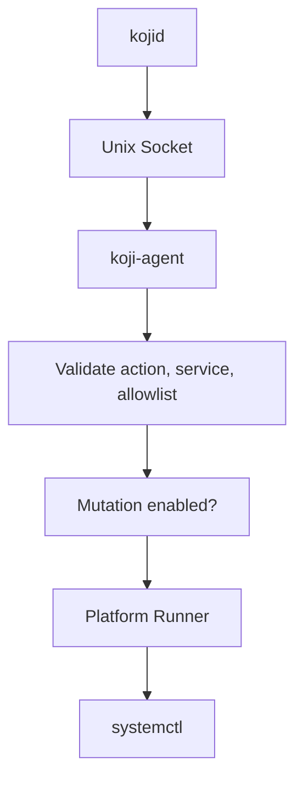

# Agent Architecture

[Home](../Home.md) | Related: [Agent Mutation Controls](../Security/Agent-Mutation-Controls.md), [Agent RPC](../Developer/Agent-RPC.md), [Troubleshooting](../Operations/Troubleshooting.md)

## What Problem This Solves

The agent isolates future privileged host mutation from the web/API daemon.

## How It Works

## What Protects It

The agent validates action, service name, service allowlist, socket path, command timeout, and output limit. Mutation is disabled by default.

## What Can Fail

The socket can be missing, refused, timed out, or unsafe. The agent can reject non-allowlisted services, unsupported actions, or disabled mutation.

## How To Diagnose It

Use `/readyz`, agent RPC counters, job failure reason codes, and systemd status for `koji-agent`.

## How To Recover

Start `koji-agent`, fix socket directory ownership, configure `agent_service_allowlist`, or intentionally enable mutation only after guardrails are reviewed.
