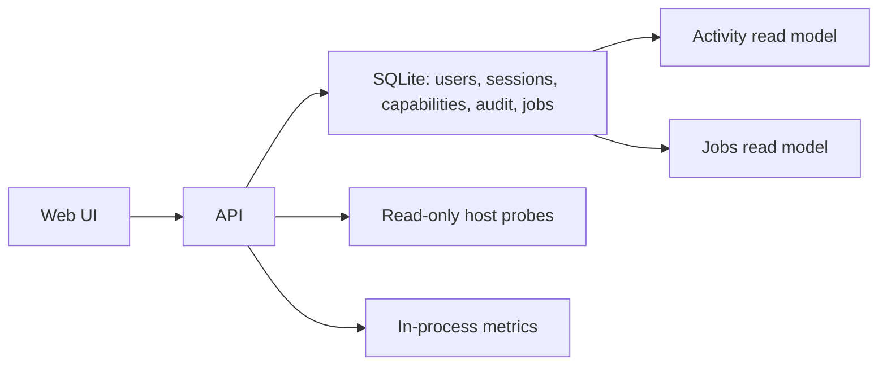

# Data Flow

[Home](../Home.md) | Related: [Database Schema](../Developer/Database-Schema.md), [Audit](../Security/Audit.md), [Observability](../Operations/Observability.md)

## What Problem This Solves

Koji stores governance state durably while keeping sensitive internals out of API responses.

## How It Works

## What Protects It

SQLite uses migrations, foreign keys, WAL, and deterministic schema tracking. Read models expose normalized fields only. Process visibility policy redacts sensitive fields before response.

## What Can Fail

The DB can be locked, unavailable, or out of migration sync. Host probes can time out or return unavailable data.

## How To Diagnose It

Check `/readyz`, audit write counters, job status counts, and backend tests for migration behavior.

## How To Recover

Restore DB ownership and path permissions under `/var/lib/koji`, fix configuration, or restore from backup.
