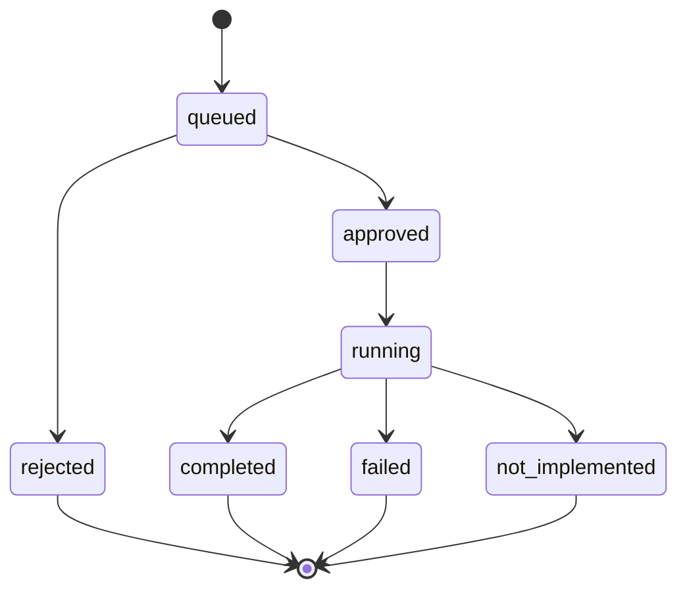

# Job Lifecycle

[Home](../Home.md) | Related: [Jobs Page](../User-Guide/Jobs-Page.md), [Job State Reference](../Reference/Job-State-Reference.md), [Job System](../Developer/Job-System.md)

## What Problem This Solves

Jobs make service-control intent durable, auditable, and approval-gated before any agent execution path is used.

## How It Works

## What Protects It

Only queued jobs can be approved or rejected. Only approved jobs can be claimed by the worker. Job decisions require `jobs.approve`. Job reads require `jobs.read`.

## What Can Fail

Jobs can remain queued without approval, remain approved if the worker is stopped, fail if the agent is unavailable, or become `not_implemented` when the agent reports unsupported behavior.

## How To Diagnose It

Use the Jobs page, Activity page, request ID, and metrics counters such as `jobs_created_total`, `jobs_failed_total`, and `worker_errors_total`.

## How To Recover

Approve or reject queued jobs, restart `kojid` if the worker is not polling, start `koji-agent`, or leave mutation disabled until explicitly enabled.
