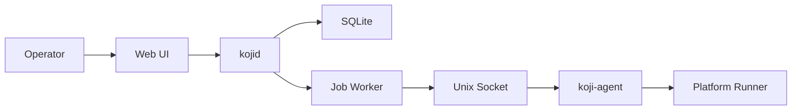

# Architecture Overview

[Home](../Home.md) | Related: [Trust Boundaries](Trust-Boundaries.md), [Request Flow](Request-Flow.md), [Job Lifecycle](Job-Lifecycle.md)

## What Problem This Solves

Koji separates visibility, authorization, durable intent, and privileged execution so operators can administer hosts without turning the web/API daemon into an unrestricted mutation surface.

## How It Works

`kojid` serves the web UI and API, validates sessions, checks capabilities, records audit events, creates durable jobs, and observes read-only host state. `koji-agent` owns the local privileged boundary through a Unix socket. Service-control requests become jobs before any agent interaction.

## What Protects It

- Authentication proves who is calling.
- Capabilities decide what a principal may do.
- CSRF protects state-changing authenticated requests.
- Audit records sensitive intent and decisions.
- Service allowlists prevent arbitrary systemd inspection or mutation.
- Agent mutation is disabled unless explicitly configured.

## What Can Fail

The database can be unavailable, migrations can be stale, the agent socket can be absent, the service allowlist can omit a unit, or a user can lack a capability.

## How To Diagnose It

Use `/healthz`, `/readyz`, the Overview observability cards, the Jobs page, and the Activity page. For deeper operational steps, use [Troubleshooting](../Operations/Troubleshooting.md).

## How To Recover

Recover by restoring DB access, applying the correct configuration, starting the agent, granting the required capability, or rejecting and recreating stale jobs after the underlying issue is fixed.
