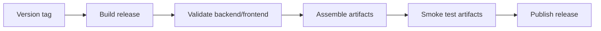

# Release Architecture

[Home](../Home.md) | Related: [Release Operations](../Operations/Release-Operations.md), [Release Workflow](../Developer/Release-Workflow.md)

## What Problem This Solves

Release automation verifies artifacts before publishing them to users.

## How It Works

## What Protects It

CI runs Go tests, frontend tests, frontend build, release assembly, checksum generation, rootfs layout checks, systemd unit checks, forbidden path scans, and smoke tests before publishing.

## What Can Fail

Builds can fail from test regressions, missing executable bits, stale paths, checksum mismatch, or GitHub artifact handling.

## How To Diagnose It

Inspect the failed workflow job and compare it with [Release Operations](../Operations/Release-Operations.md).

## How To Recover

Fix the failing gate, tag a new patch version, and verify downloaded assets before announcing the release.
