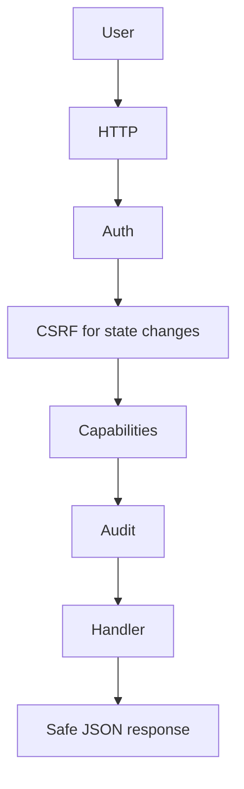

# Request Flow

[Home](../Home.md) | Related: [Authentication](../Security/Authentication.md), [Capabilities](../Security/Capabilities.md), [Audit](../Security/Audit.md)

## What Problem This Solves

Every protected request follows the same governance sequence before reaching handler logic.

## How It Works

## What Protects It

Protected API routes deny by default. Public surfaces are limited to health, readiness, bootstrap, login, logout, and session status. State-changing authenticated requests require CSRF validation.

## What Can Fail

Requests can fail because the session is missing, expired, or revoked; CSRF is missing; the user lacks a capability; or a dependency returns a safe operational error.

## How To Diagnose It

Use response status, safe error text, Activity audit rows, and request IDs. See [Error Code Reference](../Reference/Error-Code-Reference.md).

## How To Recover

Sign in again, refresh to get a current CSRF token, request the needed capability, or resolve the failing dependency.
