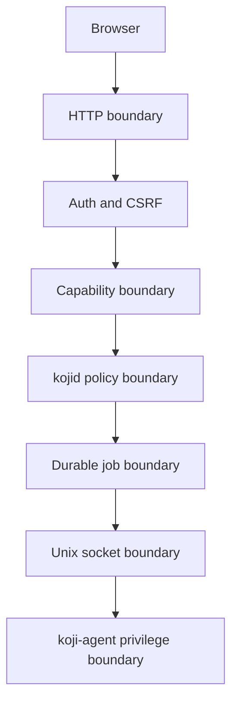

# Trust Boundaries

[Home](../Home.md) | Related: [Agent Architecture](Agent-Architecture.md), [Capabilities](../Security/Capabilities.md), [Agent Mutation Controls](../Security/Agent-Mutation-Controls.md)

## What Problem This Solves

Trust boundaries prevent a browser request from becoming direct privileged host mutation.

## How It Works

## What Protects It

`kojid` may observe authorized host data and create jobs. `koji-agent` owns future privileged mutation. SQLite stores sessions, capabilities, audit events, and jobs. The browser never receives raw internal errors, SQL failures, or command output.

## What Can Fail

A boundary fails operationally when configuration is invalid, session state is expired, capabilities are missing, the agent is unavailable, or mutation remains disabled.

## How To Diagnose It

Check `/readyz`, Activity events for denied outcomes, Jobs status, and [Observability](../Operations/Observability.md).

## How To Recover

Correct configuration, grant only the needed capability, restart the missing dependency, or keep mutation disabled until the local security model is intentionally enabled.
