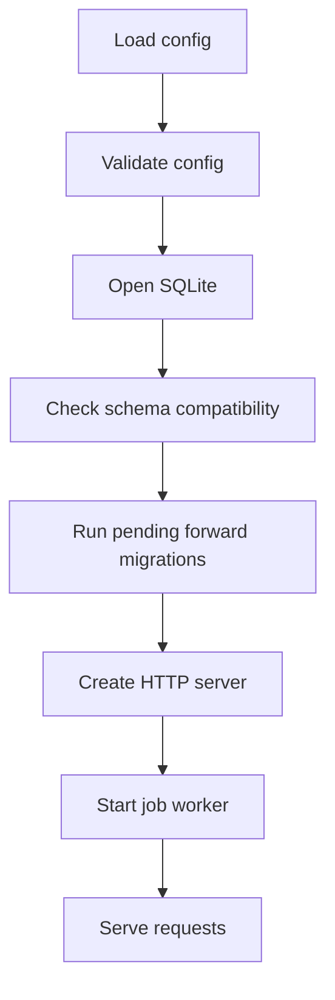

# Backend Inventory

[Home](../Home.md) | Related: [Backend Architecture](Backend-Architecture.md), [Database Schema](Database-Schema.md), [Architectural Inventory](Architectural-Inventory.md)

This inventory documents backend architectural surfaces. It intentionally omits private helper functions unless they define a subsystem boundary.

| Package | Surface | Purpose | Inputs | Outputs | Dependencies |
| --- | --- | --- | --- | --- | --- |
| `cmd/kojid` | `run`, `initializeDatabase`, `startJobWorker` | Start the daemon, load config, initialize DB, serve HTTP, and run the job worker. | Config file, CLI flags, OS signals. | HTTP server, worker loop, process exit status. | `internal/config`, `internal/db`, `internal/http`, `internal/jobs`, `internal/agent`. |
| `cmd/koji-agent` | agent process entrypoint | Load agent config and start Unix socket RPC server. | Agent config, socket path. | Local socket server. | `internal/config`, `internal/agent`. |
| `internal/config` | `Config`, `Load`, `LoadAgent`, `Validate`, `ValidateAgent` | Parse strict config and enforce runtime policy. | YAML-like config files and flag overrides. | Validated `Config`. | `internal/system` service-name validation. |
| `internal/db` | `Open`, `RunMigrations`, `CheckSchemaCompatibility` | Open SQLite, apply PRAGMAs, validate schema compatibility, and run deterministic migrations. | DB path, migration list. | `*sql.DB`, migration status or error. | `database/sql`, SQLite driver. |
| `internal/auth` | `Store`, `SessionPolicy` | Manage bootstrap, login, session validation, CSRF, revocation, and cleanup. | Credentials, cookies, CSRF tokens. | `Session`, `Principal`, auth errors. | SQLite tables `users`, `sessions`, `bootstrap_state`. |
| `internal/identity` | `Store`, `User`, `MagicToken` | Manage users, capability assignment, enable/disable state, magic token issue, and self-lockout prevention. | Admin principal, target user IDs, capability names, token TTL. | User lists, capability lists, raw one-time token at issue, safe domain errors. | SQLite tables `users`, `user_capabilities`, `magic_tokens`, `sessions`; `internal/caps`. |
| `internal/caps` | `Store.Require`, capability constants | Enforce deny-by-default capability checks. | User ID, capability. | Success or `ErrCapabilityDenied`. | SQLite `user_capabilities`. |
| `internal/audit` | `Store.Record`, `ListRecent` | Persist governance events and expose normalized recent activity. | `audit.Event`, limit. | Durable row, `ActivityEvent` list. | SQLite `audit_events`, observability registry. |
| `internal/jobs` | `Store`, `Worker` | Store durable jobs, approve/reject, claim approved work, and finalize worker outcomes. | Service-control intent, decisions, agent results. | `Job` records and audit events. | SQLite `jobs`, `internal/agent`, `internal/audit`, observability. |
| `internal/agent` | `Client`, `Server`, `Executor`, `ServiceController` | Transport service-control intent across a Unix socket and guard future mutation. | RPC request, agent config. | Normalized RPC response or client error. | `net`, `internal/platform/command`, `internal/system`. |
| `internal/platform/command` | bounded command runners | Centralize bounded, allowlisted command execution. | Command name, args, timeout, output limit. | Bounded output or normalized error. | `os/exec`; no HTTP or system package owns direct execution. |
| `internal/system` | host probes | Read host metrics, disk, process, and service state. | Probe requests and config policy. | Redacted or bounded host observations. | `/proc`, platform command runner. |
| `internal/http` | route registration and handlers | Expose health, auth, protected APIs, static assets, middleware, JSON, request IDs. | HTTP requests, session cookies, CSRF headers. | JSON responses, safe errors, audit writes. | Auth, caps, audit, jobs, system, observability, agent config. |
| `internal/observability` | `Registry`, `Snapshot` | Maintain counters and job status aggregates. | Counter names, DB handle. | Snapshot JSON. | SQLite jobs table. |
| `packaging` | packaging tests | Verify install layout, release scripts, backup/restore, and upgrade scripts. | Repository files and temporary fixtures. | Test pass/fail. | Shell scripts, SQLite CLI. |

## Startup Flow

## Request Flow

Protected API requests pass through request ID, security headers, auth gate, CSRF for state-changing requests, capability checks, handler logic, and audit where required. Identity administration requests add `identity.users.manage` and self-lockout checks before changing user or capability state.
