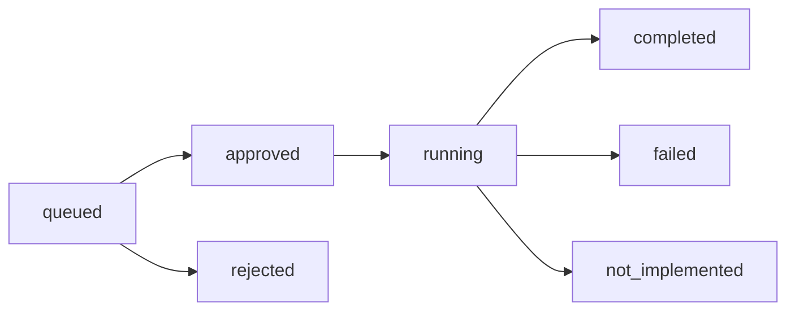

# Job State Reference

[Home](../Home.md) | Related: [Job Lifecycle](../Architecture/Job-Lifecycle.md), [Jobs Page](../User-Guide/Jobs-Page.md), [Backend Inventory](../Developer/Backend-Inventory.md)

Job states are defined in `internal/jobs`.

| State | Meaning | Owner | Valid Next States |
| --- | --- | --- | --- |
| `queued` | Service-control intent is durable and waiting for human decision. | HTTP job creation. | `approved`, `rejected` |
| `approved` | A user with `jobs.approve` approved the queued job. | HTTP approval handler. | `running` |
| `rejected` | A user with `jobs.approve` rejected the queued job. | HTTP rejection handler. | Terminal |
| `running` | Worker atomically claimed an approved job. | Job worker. | `completed`, `failed`; `not_implemented` is defined but currently represented by `failed` with reason `not_implemented` in the worker path. |
| `completed` | Agent path completed successfully. | Job worker. | Terminal |
| `failed` | Worker or agent path failed safely. | Job worker. | Terminal |
| `not_implemented` | Agent reported unsupported behavior. | Job worker. | Terminal |

## Transition Diagram

## Transition Rules

- Only `queued` jobs can be approved or rejected.
- Only `approved` jobs can be claimed by the worker.
- Claiming sets `started_at` and moves the job to `running`.
- Terminal jobs are not retried in place.
- Agent `not_implemented` currently records `status=failed` and `status_reason=not_implemented`; the `not_implemented` status remains a defined lifecycle value and API contract value.
- Service-control requests create jobs; they do not execute directly in the HTTP handler.

## Limits

Default job list limit is 50. Maximum list limit is 100.

## Recovery

For failed terminal jobs, fix the cause and create a new service-control request. Do not mutate job state manually in SQLite during normal operation.
