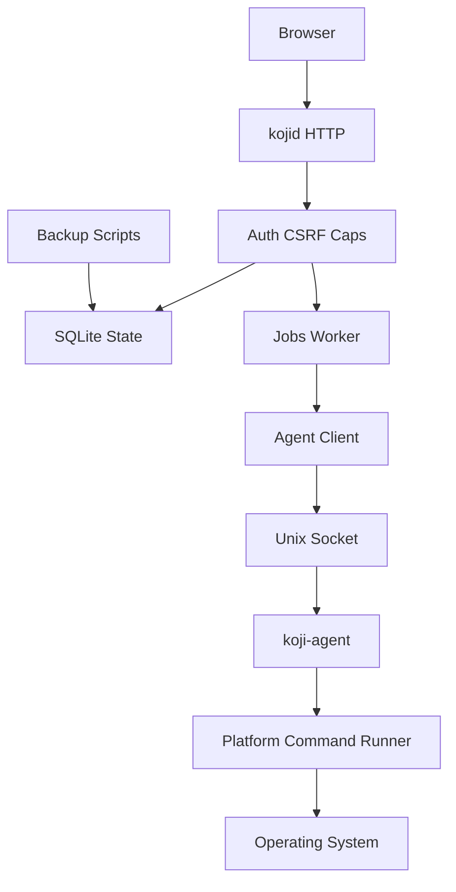

# Threat Model

[Home](../Home.md) | Related: [Trust Boundaries](../Architecture/Trust-Boundaries.md), [Security Review](Security-Review.md), [Capabilities](Capabilities.md), [Agent Mutation Controls](Agent-Mutation-Controls.md)

## Executive Summary

Koji's highest-risk areas are identity administration, service-control job integrity, agent socket trust, audit durability, and backup exposure. The current design has strong layered controls: authenticated production SPA/API, CSRF, per-surface capabilities, service allowlists, durable jobs, human approval, audit, bounded command execution, and a Unix socket agent boundary. Residual risk remains when an authenticated user has broad capabilities, when filesystem ownership around the database/socket/backups is weak, or when magic tokens or backups leave trusted operator channels.

## Scope And Assumptions

In scope:

- `cmd/kojid`, `cmd/koji-agent`
- `internal/auth`, `internal/identity`, `internal/caps`, `internal/audit`, `internal/jobs`, `internal/agent`, `internal/http`, `internal/system`, `internal/platform`
- `web/src`
- `packaging/scripts`
- `docs/api`

Out of scope:

- Third-party dependency vulnerability analysis.
- Linux distribution hardening outside packaged unit/config paths.
- Multi-node or multi-tenant SaaS operation.

Assumptions:

- Koji is deployed as a local Linux host control panel, not a public multi-tenant service.
- TLS termination or localhost-only exposure is handled by deployment policy; the Go server currently owns HTTP behavior and security headers, not certificate management.
- Operators protect `/etc/koji`, `/var/lib/koji`, `/run/koji`, `/usr/share/koji`, and backup artifacts with system permissions.
- `koji-agent` may run with elevated local privileges when mutation is intentionally enabled.
- Browser clients are untrusted.

Open questions that would materially change risk:

- Is production intended to be reachable over a network beyond localhost or a private admin network?
- Will multiple administrators share one deployment with different operational duties?
- Will backups be exported to external storage, and if so, how are they encrypted and access-controlled?

## System Model

### Primary Components

- Browser UI: React/TypeScript SPA under `web/src`.
- `kojid`: HTTP/API daemon in `cmd/kojid` and `internal/http`.
- SQLite: durable users, sessions, capabilities, magic tokens, audit, jobs, and migrations through `internal/db`.
- Auth/session layer: `internal/auth`.
- Identity/capability layer: `internal/identity` and `internal/caps`.
- Jobs/worker: `internal/jobs`.
- Agent client/server: `internal/agent`.
- Privileged command runner: `internal/platform/command`.
- Backup/release scripts: `packaging/scripts`.
- OpenAPI contract: `docs/api/openapi.json`.

### Data Flows And Trust Boundaries

- Browser -> `kojid` HTTP: credentials, magic tokens, CSRF headers, API requests, service/job/admin intent. Protected by auth gate, CSRF for state-changing requests, capability checks, security headers, request IDs, and response normalization. Evidence: `internal/http/middleware.go`, `internal/http/routes.go`.
- `kojid` -> SQLite: sessions, users, magic-token hashes, capabilities, audit events, jobs, migration state. Protected by SQLite foreign keys, WAL, migrations, and compatibility checks. Evidence: `internal/db`, `internal/auth/store.go`, `internal/identity`, `internal/jobs`.
- `kojid` -> `koji-agent`: service-control job execution request over Unix socket. Protected by socket path validation, normalized RPC errors, and no TCP transport. Evidence: `internal/agent/client.go`, `internal/agent/server.go`.
- `koji-agent` -> operating system: guarded service mutation only when explicitly enabled. Protected by action validation, service allowlist, bounded command runner, and normalized result codes. Evidence: `internal/agent/executor.go`, `internal/platform/command/runner.go`.
- Operator -> backup/restore scripts: database and config archive operations. Protected by explicit scripts and verification, but backup confidentiality depends on filesystem/storage policy. Evidence: `packaging/scripts/backup.sh`, `packaging/scripts/verify_restore.sh`.
- Developer/release -> artifacts: build outputs, checksums, smoke tests, release workflow. Protected by release validation and checksums. Evidence: `.github/workflows`, `packaging/scripts`.

#### Diagram

## Assets And Security Objectives

| Asset | Objective | Why It Matters |
| --- | --- | --- |
| Sessions and CSRF tokens | Confidentiality and integrity | Session theft or CSRF bypass permits unauthorized protected API use. |
| Magic tokens | Confidentiality and one-time integrity | Leaked tokens can create sessions for managed users until expiry or consumption. |
| Capability assignments | Integrity | Overbroad or malicious grants enable process/service/audit/admin access. |
| Jobs and approvals | Integrity | Tampered jobs can misrepresent privileged operator intent. |
| Agent socket | Integrity and access control | Socket replacement or unauthorized access could cross the privilege boundary. |
| Audit records | Integrity and availability | Incident review depends on durable, trustworthy event history. |
| SQLite database | Confidentiality, integrity, availability | Holds identity, authorization, audit, jobs, and token hashes. |
| Backups | Confidentiality and integrity | Backups include DB/config and can expose governance state if stolen. |
| OpenAPI docs | Controlled disclosure | API discoverability helps integration but also helps attackers enumerate surfaces. |

## Attacker Model

Realistic capabilities:

- Unauthenticated web visitor reaching the HTTP surface.
- Authenticated user with no special capabilities.
- Authenticated user with one narrow capability such as `jobs.read`.
- Authenticated user with high-risk capabilities such as `identity.users.manage`, `jobs.approve`, or `host.services.control`.
- Local user able to interact with filesystem paths if OS permissions are weak.
- Operator or process with access to backup artifacts.

Non-capabilities assumed out of scope unless deployment policy fails:

- Root on the host.
- Direct write access to `/var/lib/koji/koji.db`.
- Direct write access to `/run/koji/agent.sock`.
- Ability to modify packaged binaries or systemd units.
- Ability to bypass TLS or network controls outside Koji.

## Threats

| Threat | Impact | Likelihood | Existing Control | Residual Risk | Recommended Action |
| --- | --- | --- | --- | --- | --- |
| Authenticated identity administrator grants themselves or others broad capabilities. | High: can expand access to jobs, audit, host telemetry, and service-control intent. | Medium: requires `identity.users.manage`, but that capability is intentionally powerful. | Dedicated capability, CSRF, audit events, self-lockout prevention. Evidence: `internal/http/handlers_admin.go`, `internal/identity`. | Broad grants are valid actions, so misuse is governance risk rather than a code bypass. | Add periodic capability review guidance and alerting on `identity.capability_granted` for high-risk capabilities. |
| Magic token leaks before consumption. | High: attacker can create a valid session for the target user until expiry. | Medium: raw token is intentionally shown once and may be copied through external channels. | Token hash storage, one-time consumption, TTL default, disabled-user rejection, audit. Evidence: `internal/auth/store.go`, `internal/identity/magic_tokens.go`. | External transmission channel is outside Koji. | Document approved token delivery channels and consider short operator-configurable TTL presets. |
| User with `host.services.control` creates harmful service-control jobs. | High: future mutation can start/stop/restart allowlisted units after approval. | Medium: requires capability and allowlisted service. | Capability, daemon allowlist, job creation, audit, approval, worker, agent guardrails. Evidence: `internal/http/handlers_services.go`, `internal/jobs`, `internal/agent`. | A legitimate approver can still approve harmful work. | Require operational separation between requester and approver in a future phase if deployment requires it. |
| Approval bypass through direct job state tampering. | High: approved/running jobs can advance toward agent execution. | Low if DB permissions hold; medium if SQLite file is writable by unintended users. | State transitions live in store methods and worker claim logic; DB path is under `/var/lib/koji`. Evidence: `internal/jobs`, packaging systemd/runtime docs. | SQLite cannot protect against local filesystem write access by privileged users. | Verify install ownership and add runtime permission checks for DB/config paths. |
| Agent socket replacement or unauthorized local socket access. | High: could cross daemon-to-agent privilege boundary. | Low to medium depending on `/run/koji` ownership. | Absolute socket path validation, parent ownership checks, refusal to remove non-socket path. Evidence: `internal/agent/server.go`. | Socket file permissions after bind are deployment-dependent. | Explicitly set socket file mode/ownership after bind and document expected systemd runtime directory mode. |
| Agent mutation enabled with overbroad allowlist. | High: service mutation becomes operationally powerful. | Low by default; medium after intentional enablement. | Mutation disabled by default, action/service validation, agent allowlist, bounded runner. Evidence: `internal/agent/executor.go`. | Overbroad allowlist is a policy error Koji cannot infer. | Add a deployment checklist requiring review of `agent_service_allowlist` before enabling mutation. |
| Audit persistence failure hides sensitive activity. | Medium to high: incident review loses evidence. | Medium during DB/full-disk or permission failures. | Audit write counters, readiness, Activity read model. Evidence: `internal/audit`, `internal/observability`. | Some handlers continue after audit write failure by design. | Define fail-closed policy for selected high-risk admin/job actions in a future phase. |
| Backup artifact theft exposes governance state. | High: backups contain DB/config and may include users, token hashes, audit, jobs, capabilities. | Medium if backups are copied off host without encryption. | Backup scripts create explicit artifacts and metadata; verification supports recovery. Evidence: `packaging/scripts/backup.sh`. | Backup confidentiality is external to Koji. | Add documented encryption/storage requirements and optional encrypted backup wrapper. |
| OpenAPI exposure helps attackers enumerate routes. | Low to medium: route discovery gets easier, but protected routes still require auth/caps/CSRF. | Medium if docs are public. | Deny-by-default API, generated reference documents capability requirements. Evidence: `docs/api/openapi.json`, `make verify-openapi`. | Public docs still reduce obscurity. | Treat OpenAPI as non-secret and keep all route protections server-side. |
| Dev-mode auth bypass is used outside development. | Critical: protected APIs become publicly accessible. | Low if config discipline holds; high if misconfigured. | `dev_mode` is explicit and audit/dev headers mark bypasses. Evidence: `internal/http/middleware.go`, config docs. | Config mistake can disable production auth. | Add startup warning or refusal when `dev_mode=true` with production paths/listen settings. |

## Abuse-Case Probes

| Probe | Expected Result | Evidence |
| --- | --- | --- |
| Unauthenticated request to protected API | `401` except public auth/session/health/readiness surfaces. | `AuthGateMiddleware`, `isPublicAuthSurface`. |
| Authenticated user with only `jobs.read` tries service control | `403` and capability denial audit where applicable. | `internal/caps`, protected handlers. |
| User with `identity.users.manage` tries to disable final identity administrator | Conflict and `identity.self_lockout_prevented` audit. | `internal/identity/lockout.go`, `internal/http/handlers_admin.go`. |
| Leaked consumed magic token is reused | `401` safe failure. | `LoginMagicToken`, `txConsumeMagicToken`. |
| Agent socket path points to a normal file | Server refuses to remove it. | `removeStaleSocket`, agent tests. |
| Non-allowlisted service is submitted | Request fails before job/agent mutation path. | service allowlist handlers and docs. |
| Backup archive is stolen | Attacker may inspect DB/config offline. | `backup.sh` archive content. |

## Focus Paths For Manual Review

- `internal/http/middleware.go`: auth gate, CSRF gate, dev bypass, public surface list.
- `internal/http/handlers_admin.go`: identity administration audit and error handling.
- `internal/auth/store.go`: session creation, magic-token login, CSRF validation.
- `internal/identity`: user lifecycle, capability assignment, magic-token issue, self-lockout policy.
- `internal/caps`: capability lookup and deny behavior.
- `internal/jobs`: job state transitions, approval, worker claim and completion.
- `internal/agent`: Unix socket client/server and guarded executor.
- `internal/platform/command`: bounded command execution ownership.
- `packaging/systemd`: runtime user, directory, and unit hardening.
- `packaging/scripts/backup.sh`: backup contents and artifact confidentiality assumptions.
- `docs/api/openapi.json`: route/capability contract alignment.

## Quality Check

- Entry points covered: HTTP routes, auth surfaces, admin APIs, jobs APIs, agent RPC, backup scripts, OpenAPI docs.
- Trust boundaries covered: browser-to-daemon, daemon-to-DB, daemon-to-agent, agent-to-OS, operator-to-backup.
- Runtime and CI/build concerns are separated.
- Assumptions and open questions are listed above.
- Threats include authenticated attackers, high-risk capabilities, socket replacement, stolen backups, and leaked magic tokens.
